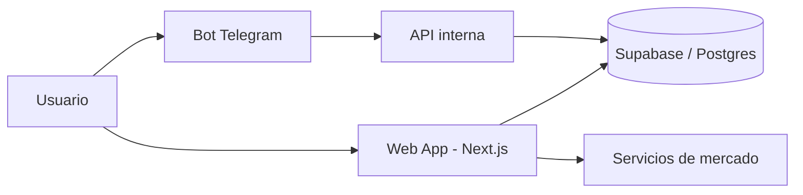
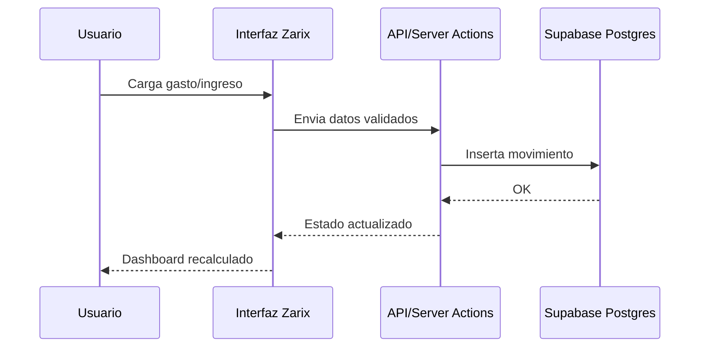

# Zarix

Zarix es una app de finanzas personales para uso individual, enfocada en Argentina.

> Control simple, rapido y visual de tu dinero en un solo lugar.

## Indice

- [Que es Zarix](#que-es-zarix)
- [Secciones principales](#secciones-principales)
- [Stack tecnologico](#stack-tecnologico)
- [Arquitectura y flujo](#arquitectura-y-flujo)
- [Instalacion local](#instalacion-local)
- [Buenas practicas de seguridad](#buenas-practicas-de-seguridad)
- [FAQ](#faq)

## Que es Zarix

La web de Zarix te permite:

- ver tu patrimonio y saldos en un dashboard claro,
- registrar y editar movimientos,
- administrar cuentas y categorias,
- seguir inversiones,
- consultar cotizaciones y mercados,
- importar y exportar tus datos.

## Secciones principales

### Dashboard
- Resumen de patrimonio liquido y total.
- Cotizaciones de dolar y crypto.
- Ultimos movimientos.
- Estado general de tarjetas.

### Movimientos
- Alta, edicion y eliminacion de gastos/ingresos/transferencias.
- Filtros por fecha, cuenta, categoria y tipo.

### Cuentas
- Gestion de cuentas (banco, efectivo, tarjetas, billeteras, inversiones).
- Soporte de tarjetas bi-moneda.
- Saldos negativos permitidos.

### Inversiones
- Portafolio con posiciones y P&L.
- Vista de mercado para USA y Merval.

### Analisis
- Graficos de gastos por categoria.
- Tendencia mensual.
- Flujo de caja.
- Top de gastos para detectar desbalances.

### Presupuestos y recurrentes
- Presupuestos por categoria.
- Reglas de movimientos recurrentes.

### Configuracion
- Preferencias de usuario.
- Importacion y exportacion de datos (CSV/JSON/backup).

## Stack tecnologico

- **Frontend**: Next.js 14, React 18, Tailwind CSS, Recharts.
- **Backend/Data**: Supabase (PostgreSQL + Auth + APIs).
- **Automatizaciones**: Telegram Bot (Telegraf), scripts Node/TS.
- **Integraciones**: cotizaciones y mercado (Yahoo Finance y fuentes externas).
- **Validacion y estado**: Zod + Zustand.

## Arquitectura y flujo

### Vista general



### Flujo simplificado de un movimiento



### Mapa funcional rapido

```text
Zarix
├── Dashboard
├── Movimientos
├── Cuentas y Tarjetas
├── Inversiones
├── Analisis
└── Import / Export
```

## Instalacion local

### 1) Requisitos

- Node.js 18+
- npm 9+
- Proyecto Supabase configurado

### 2) Levantar el proyecto

```bash
npm install
npm run dev
```

### 3) Scripts utiles

```bash
npm run build            # build de produccion
npm run lint             # chequeo de codigo
npm run db:push          # aplica cambios de DB en Supabase
npm run db:reset         # resetea DB local/sandbox
npm run telegram:webhook # configura webhook de Telegram
```

## Buenas practicas de seguridad

Para compartir este repositorio o mostrarlo publicamente sin comprometer tus datos:

- No subir secretos a Git (`.env`, tokens, claves privadas, credenciales de bot).
- Usar variables de entorno para keys y URLs sensibles.
- Nunca hardcodear IDs de cuentas reales, usuarios reales ni movimientos reales.
- Anonimizar cualquier CSV/JSON de ejemplo antes de compartirlo.
- Mantener politicas de acceso en Supabase (Auth + RLS cuando aplique).
- Revisar logs y scripts para evitar `console.log` con informacion sensible.
- Definir `CRON_SECRET` en produccion: sin valor, los endpoints `/api/cron/*` quedan cerrados (no usar `Bearer undefined`).
- El login de desarrollo (`/api/auth/dev-login`) en produccion responde 404 salvo que configures explicitamente `ALLOW_DEV_LOGIN=true` (solo si lo necesitas y con `DEV_LOGIN_SECRET` fuerte).

> Recomendado: crear un `.env.example` con placeholders y sin valores reales.

## Funcionalidad base

- Registro manual en web.
- Soporte de carga por bot de Telegram.
- Parseo de tickets por imagen (con confirmacion).
- Multi-moneda: ARS, USD, USDT, BTC, ETH.

## FAQ

### Para quien esta pensada Zarix?
Para una persona que quiere controlar sus finanzas de forma simple y rapida.

### Puedo usarla desde celular?
Si, esta optimizada para mobile y se puede usar como PWA.

### Puedo importar movimientos que ya tengo?
Si, podes importar desde CSV o JSON.

### Puedo exportar mi informacion?
Si, podes exportar transacciones y tambien backup completo.

### Tiene soporte para inversiones?
Si, incluye portafolio y seguimiento de rendimiento.
